# Software Engineering

***
复习范围：软件危机、软件工程的概念，软件生命周期，可行性研究，需求分析、设计，模块独立性的相关概念，面向对象模型的概念，面向对象的分析和设计，测试用例相关概念等
数据流图，状态图，流程图，盒图，判定表判定树，测试，用例图，事件跟踪图，软件项目管理

补充：er图，PDL，以上这些范围每年都会考，都是活题，不用整本书死记硬背
## 概念啊嗯

### 软件项目管理
请举三个例子说明在软件项目管理中，需要注意哪些风险？你会如何预防这些风险？  

答：包括三方面的风险：项目风险、技术风险、商业风险  
项目风险：潜在的预算、进度、个人、资源用户和需求方面的问题以及它们对软件项目的影响。  
技术风险：潜在的设计、实现、接口、检验、和维护方面的问题  
商业风险：市场风险、预算风险等。  
预防风险的措施：  
1. 与现在在职的人员协商，确定人员流动的原因  
2. 在项目开始之前，把缓解这些原因的工作列入以拟定的计划中  
3. 当项目启动时，做好人员流动会出现的准备。采取一些办法以确保人员一旦离开时项目仍能继续。  
4. 建立项目组，以使大家都了解有关开发活动的信息  
5. 制定文档标准，并建立一种机制以保证文档能够及时产生  
6. 对所有工作组织细致的评审  
7. 对每一个关键性的技术人员，要培养后备人员。
> 我只能说求放过
> 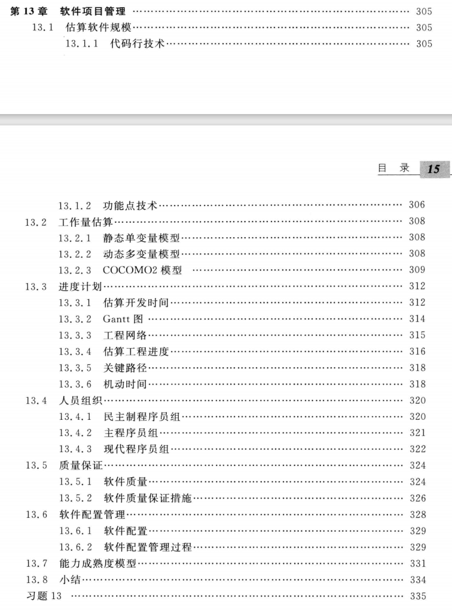

### 软件工程

#### 是什么?
根据1993年IEEE的定义：

1. 把系统的、规范的、可度量的途径应用于软件开发、运行和维护过程，也就是把工程应用于软件；
2. 研究1中提到的途径。  

#### 本质特征
软件工程的本质特征：  
1. 软件工程关注于大型程序(软件系统)的构造  		
2. 软件工程的中心课题是分解问题，控制复杂性  		
3. 软件是经常变化的，开发过程中必须考虑软件将来可能的变化  
4. 开发软件的效率非常重要，因此，软件工程的一个重要课题就是，寻求开发与维护软件的更好更有效的方法和工具  
5. 和谐地合作是开发软件的关键  	
6. 软件必须有效地支持它的用户  
7. 在软件工程领域中是由具有一种文化背景的人替具有另一种文化背景的人(完成一些工作)  

#### 为什么获取需求很困难
1. 用户需求具有动态性，即需求的不稳定性。  
2. 用户需求具有模糊性，即需求不准确性。  
3. 需求复杂并且庞大。  

#### 需求自身经常变动的解决策略
1. 尽可能地分析清楚哪些是稳定的需求，哪些是易变的需求。  
2. 在合同中一定要说清楚“做什么”和“不做什么”。  

#### 需求的特点
1. 可验证性
2. 优先级
3. 唯一性

#### 需求的获取方法
1. 系统分析师应对用户进行需求分析培训  
2. 用户应参加业务需求分析的全过程  
3. 向用户发放需求调查表格  
4. 召开需求调研会  
5. 深入到重点岗位了解需求  
6. 必要时参加实际的业务工作  
7. 边分析边整理文档，边征求修改意见  
8. 定期向操作层、管理层、决策层分别汇报，演示目标系统的流程、功能、性能、接口及界面的需求  

### 软件危机
#### 软件危机定义
在计算机软件的开发和维护过程中所遇到的一系列严重问题，它包括两方面：
1. 如何开发软件，已满足对软件日益增长的需求；  
2. 如何维护数量不断增长的已有软件。

#### 软件危机的典型表现 
1. 对软件开发成本和进度的估计常常很不准确。常常出现实际成本比估算成本高出一个数量级、实际进度比计划进度拖延几个月甚至几年的现象。而为了赶进度和节约成本所采取的一些权宜之计又往往损害了软件产品的质量。这些都降低了开发商的信誉，引起用户不满。
2. 用户对已完成的软件不满意的现象时有发生。
3. 软件产品的质量往往是靠不住的。 
4. 软件常常是不可维护的。
5. 软件通常没有适当的文档资料。文档资料不全或不合格，必将给软件开发和维护工作带来许多难以想象的困难和难以解决的问题。
6. 软件成本、软件维护费在计算机系统总成本中所占比例逐年上升。
7. 开发生产率提高的速度远跟不上计算机应用普及的需求。

#### 软件危机出现的原因
1. 来自软件自身的特点：是逻辑部件，缺乏可见性；规模庞大、复杂，修改、维护困难。
2. 软件开发与维护的方法不当：忽视需求分析；认为软件开发等于程序编写；轻视软件维护。
3. 供求矛盾将是一个永恒的主题：面对日益增长的软件需求，人们显得力不从心。  

#### 消除软件危机的途径
1. 对计算机软件有一个正确的认识(软件≠程序）
2.  必须充分认识到软件开发不是某种个体劳动的神秘技巧，而应该是一种组织良好、管理严密、各类人员协同配合、共同完成的工程项目
3.  推广使用在实践中总结出来的开发软件的成功技术和方法
4.  开发和使用更好的软件工具

### 软件生存周期
> 软件生存周期定义：一个软件从定义到开发、使用和维护，直到最终被弃用，要经历一个漫长的时期，通常把软件经历的这个漫长的时期称为生存周期。  
> (1、立项/签合同 2、需求分析 3、概要设计 4、详细设计 5、编码实现 6、软件测试 7、软件发布与实施 8、软件维护 9、版本更新或退役)
> 也可以分为四个大的阶段：软件分析、软件设计、编码与测试、运行与维护。  
> 1. 软件分析时期：  
任务：确定软件项目的目标，软件应具备的功能和性能，构造软件的逻辑模型，并制定验收标准。在此期间，要进行可行性论证，并做出成本估计和经费预算，制定进度安排。进行可行性研究和项目开发计划，需求分析。  
> 2. 软件设计时期：  
任务：a.设计软件的总体结构；  
　　　b.设计软件具体模块的实现算法；  
　　　c.软件设计结束之前，也要进行有关评审，评审通过后才能进入编码时期。  
> 3. 编码与测试时期：    
任务：组织程序员将高驻地的软件“翻译”成计算机可以正确运行的程序；并且要经过按照软件分析中提出需求要求和验收标准进行严格的测试和审查。根据具体软件的特点，决定是否划分成一些阶段，如编码、单元测试、集成测试、验收测试等等。  
> 4. 运行与维护时期：  
任务：软件运行过程中可能由于各方面的原因，需要对它进行修改。  

### 经典软件过程模型

#### 瀑布模型
1. 定义：是将软件生命周期各活动规定为依线性顺序联接的若干阶段的模型，是一种整体开发模型。里程碑或基线驱动或者说文档驱动。过程逆转性很差，或者说不可逆转。
2. 优点：严格按照生命周期的各个阶段来进行开发，强调了每一阶段的严格性。这样就能解决在开发阶段后期修正不完善的需求说明将花费巨大的费用的问题。在消除非结构化软件、降低软件的复杂性、促进软件开发工程化方面起了很大作用。
3. 缺点：它是一种理想的线性开发模式，缺乏灵活性，特别是无法解决软件需求不明确或不准确的问题。故适用于功能明确、完整、无重大变化的软件开发。如：编译系统、数据库管理系统和操作系统。
4. 适用场合：    
● 在开发时间内需求没有或很少变化。  
● 分析设计人员对应用领域很熟悉。  
● 低风险项目（对目标、环境很熟悉）。  
● 用户使用环境很稳定。  
● 用户除提出需求以外，很少参与开发。  

#### 快速原型模型
1. 定义：以某个软件原型为参照模型的开发方法，叫做原型法。（原型驱动）
2. 原理：在初步需求分析之后，马上向客户展示一个软件产品原型，对客户进行培训，让客户试用，在试用中收集客户意见，修改原型，再让客户试用，反复循环几次，直到客户确认为止。
3. 适用场合：  
● 已有产品/产品原型，只需客户化的项目。  
● 简单而熟悉的行业或领域。  
● 有快速原型开发工具。  
● 进行产品移植或升级。  

#### 增量模型
1. 定义：增量模型将软件产品看作一组增量构件，每次设计、实现、集成、测试和交付一块构件，直到所有构件全部实现为止。
2. 特点：●任务或功能模块驱动，可以分阶段提交产品；●有多个任务单，这些多个任务单的集合，构成项目的一个总任务书(总用户需求报告)。
3. 适用场合：  
● 在开发过程中，客户接受分阶段交付。  
● 开发人员对应用领域不熟悉，难以一步到位。  
● 工期过紧的中等或高风险项目。  
● 用户可参与到整个软件开发过程中。  
● 使用面向对象语言或第四代语言。  
● 软件公司自己有较好的类库、构件库。  

### 软件维护
> 所谓软件维护，就是在软件产品安装、实施并交付给用户使用后，在新版本产品升级之前，这段时间里软件厂商向客户提供的服务工作，称为该软件产品的软件维护。

### 结构化维护
> 软件产品或软件项目有完善的文档，并且文档与程序代码互相匹配，两者完全一致。对这种软件产品或软件项目的维护，称为结构化维护。反之为非结构化维护。可维护软件的四个基本特性：  
①可理解性。  
②可测试性。  
③可修改性。  
④可移植性。  

### 软件维护的主要流程
> 维护的需求分析、维护的设计、修改程序代码、维护后的测试、维护后的试运行、维护后的正式运行、对维护过程的评审和审计。

### 软件维护的方法
> 第一种方法：站在C/S结构的角度上，来划分软件维护的方法。  
第二种方法：站在B/S结构的角度上，来划分软件维护的方法。  
第三种方法：站在“三种开发方法”的角度上，来划分软件维护的方法  
面向过程开发：结构化维护方法  
面向数据开发：面向数据维护方法  
面向对象开发：面向对象维护方法，就是利用对象“继承”的特性，来达到维护应用软件的目的。  
第四种方法：站在“五个面向理论”角度，即站在“面向流程分析、面向数据设计、面向对象实现、面向功能测试、面向过程管理”的角度上，来划分软件维护的方法。

### 软件质量
> 关于软件质量的定义有多种说法，从实际应用来说，软件质量的定义为:  
①与所确定的功能和性能需求的一致性  
②与所成文的开发标准的一致性  
③与所有专业开发的软件所期望的隐含特性的一致性  

### 软件项目特点
> 软件产品与其他任何产品不同，它是无形的，完全没有物理属性。其特点表现为：  
> ①智力密集，可见性差；   
> ②单件生产：在特定机型上，利用特定硬件配置，由特定的系统软件或支撑软件的支持，形成了特定的开发环境；  
> ③劳动密集，自动化程度低：  
> ④使用方法繁琐，维护困难；  
> ⑤软件工作渗透了人的因素。  

### 软件管理的功能
> 软件工程管理是对软件项目的开发管理，是对整个软件生存期的所有活动进行管理。软件管理的主要功能包括：  
> ①制定计划：规定待完成的任务、要求、资源、人力和进度等；  
> ②建立组织项目：为实施计划，保证任务的完成，需要建立分工明确的责任机构；  
> ③配备人员：任用各种层次的技术人员和管理人员；  
> ④指导：鼓励和动员软件人员完成所分配的情况。  

### 面向对象的特征  
> ①对象唯一性。每个对象都有自身的唯一标识，通过这种标识，可找到相应的对象。在对象的整个生命期中，他的标识都不改变，不同的对象不能有相同的标识。在对象建立时，由系统授予新对象以唯一的对象标识符，他在历史版本管理中又起巨大作用.  
②分类性。分类性是指具有一致的数据结构和行为的对象抽象成类。每个类是具有相同性质的个体对象的集合，而每个对象是相关类的实例。

### 结构化的程序？

#### 简单贴个选择题
> 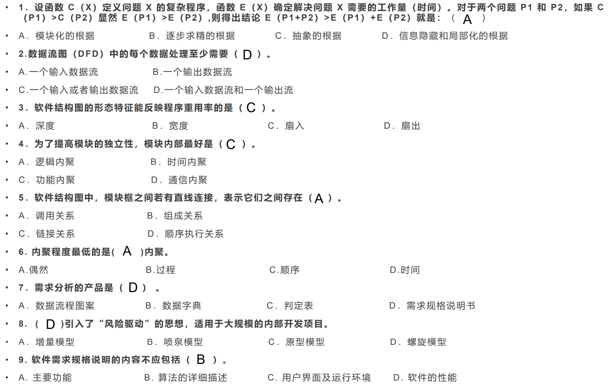

#### 原则
> 结构化程序设计采用自顶向下、逐步求精的设计方法，各个模块通过“顺序、选择、循环”的控制结构进行连接，并且只有**一个入口、一个出口**。
#### 内聚

> 是模块功能强度（即一个模块内部各个元素彼此结合的紧密程度）的度量。模块内部各元素之间联系越紧密，内聚性越强。  
> 
#### 耦合

> 是模块之间相对独立性（即互相连接的紧密程度）的度量。模块间连接越紧密，联系越多，耦合性越强。  
> 
#### 扇入

> 调用（或控制）一个给定模块的模块数目。

#### 扇出

> 一个模块直接调用（或控制）的其他模块数目。

***
## 可行性研究

### 系统流程图
> 好像和流程图差不多
> 
> 

### 数据流图

> Complete through iterations.
> 迫真迭代之每次收到数据先接受再检验一下然后再执行实际操作
> 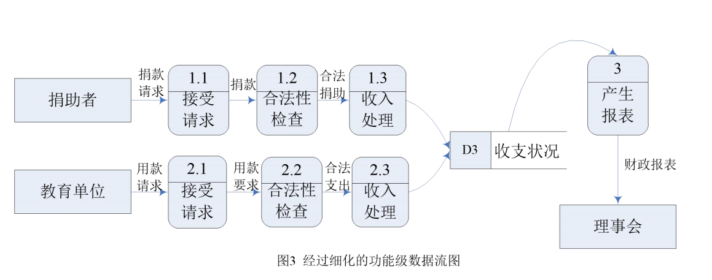
> 
> 
> 
> 
> 

### 数据字典

> 数据字典是关于数据的信息的集合，也就是对数据流图中包含的所有元素定义的集合。数据字典是结构方法的核心。数据字典有以下几个条目：数据项条目、数据流条目、文件条目和加工条目。
## 需求分析

### E-R图

>   
## 详细设计

### 程序流程图

> 很简单就是了  
> 
> 
> 

### NS图(盒图)

#### 程序方块

> 

#### 分支方块

> 
> 

#### 测试循环方块

> 先测试为while型，后测试为for型
> 

### 判定表
> 
> 

### 判定树
> 
> 

### **环形复杂度?**
1. 流图中的区域数等于环形复杂度。
2. 流图G的环形复杂度V(G)=E-N+2，其中，E是流图中边的条数，N是结点数。
3. 流图G的环形复杂度V(G)=P+1，其中，P是流图中判定结点的数目。

### PDL
> 
> 

## 实现

### 软件测试

#### 白盒测试（结构测试）

##### 总结
> 

##### 语句覆盖

每个可执行语句都走一遍即可，即测试用例要覆盖所有的语句  
> 将所有语句都执行一遍了，但是判定为FALSE的分支没有执行到
> 

##### 判定覆盖
针对判断语句，在设定案例的时候，要设定True和False的两种案例；与语句覆盖不同的是增加了False的情况
> 
> 显然是不唯一的
> 
> 

##### 条件覆盖
不仅每个语句至少执行一次，而且使判定表达式中的每个条件都取到各种可能的结果。
>    
> 人话：FT和TF即满足条件覆盖

满足条件覆盖是否一定满足判定覆盖?
> 条件覆盖通常比判定覆盖强，但满足条件覆盖的测试数据不一定满足判定覆盖。

##### 判定/条件覆盖
> 

##### 条件组合覆盖

> 判定覆盖各条件覆盖交叉，针对于判定中的条件取值  
> 

#### 黑盒测试（功能测试）

##### 等价分类法
把被测程序的输入域划分为若干各等价类，每个测试用例都代表一类与它等价的其他例子。
> 例子：两个1\~100的整数加法器，共有三种情况：输入的数**个数**是否为**两个**,数的**范围**是否为**1\~100**,数的类型是否为**整数**。  
> 答案形如
> 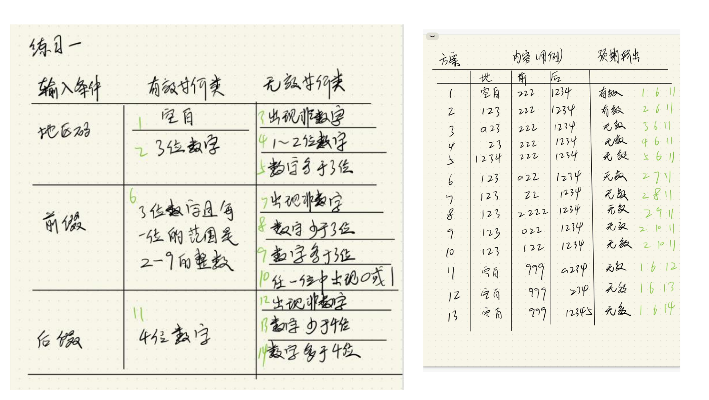
##### 边界值分析

> 在等价分类法中，将代表一个类的测试数据选在等价类的边界上。（如：X<=400）。

##  面向对象    

### 用例图

> 小人是Actor，圆圈是事件，方框是系统，左边的箭头是指向被继承者
> 
> 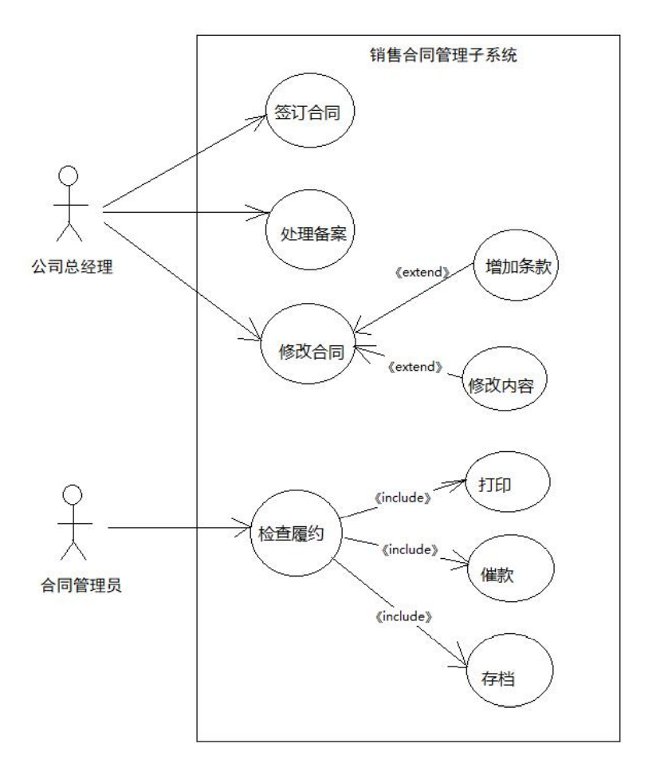
#### include & extend
表示“包含”和“扩展”，比如客户在输入用户名密码后，系统需要验证登陆有效性，这个操作是每一次登陆后必然发生的用例，我们会用 <<include>> 来连接这两个先后发生的事件；但是登陆“有可能”会失败，这时候系统会显示一个错误信息，我们把这种后续可能发生的用例，用 <<extend>> 来表示它与之前用例的关系。UML 中，“包含”和“扩展”在表现上就是虚线+箭头的形式，然后在虚线上方注释具体的关系形式。
> include指向子类，表示父类包含的处理；extend指向其父类(作为父类的可选执行)
> 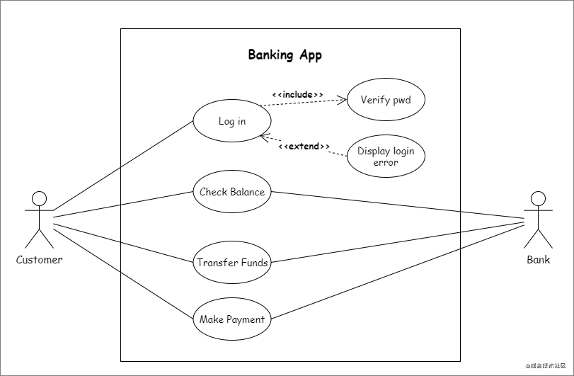
> 

### 类图

> 

### 状态图

> 好比有限状态机一般
> 箭头上的是事件，方块内的是状态
> 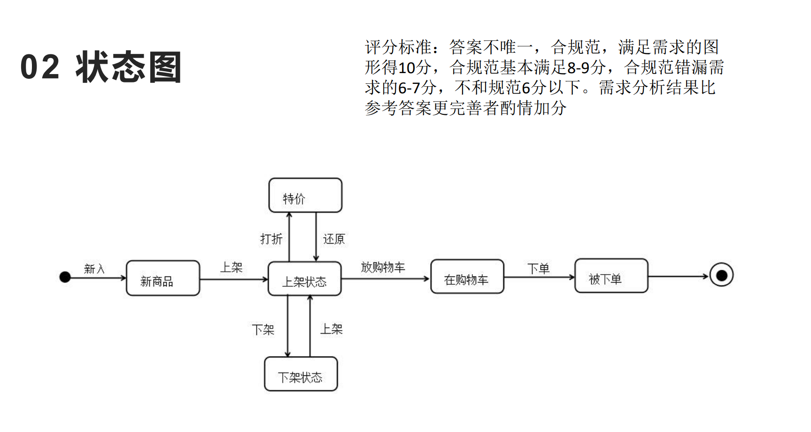
> 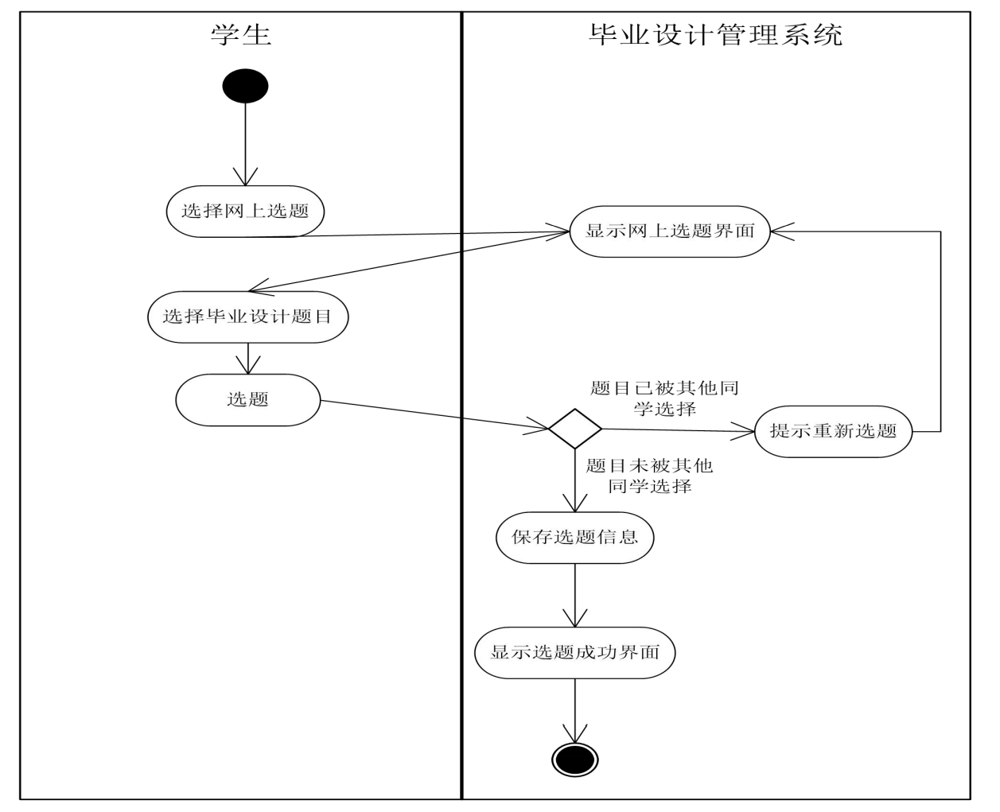
> 

### 顺序图(事件跟踪图)/时序图？

> return是虚线 一般类用方框框起来
> 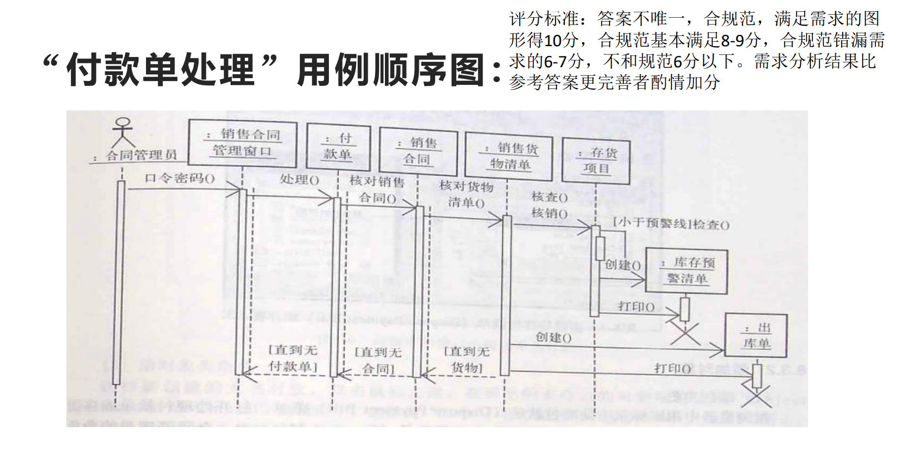
> 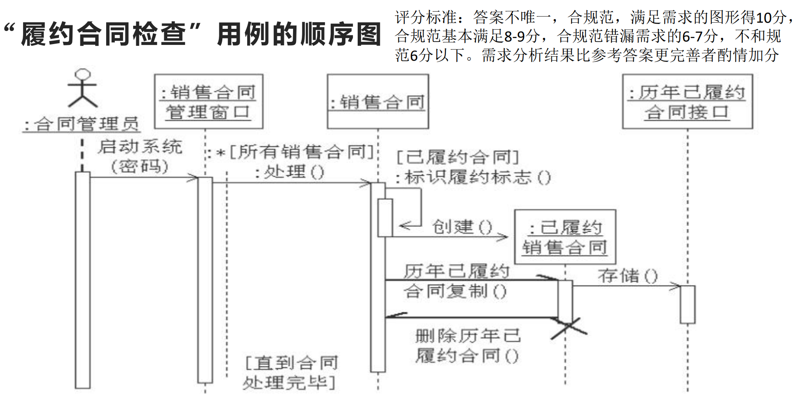
> 
> 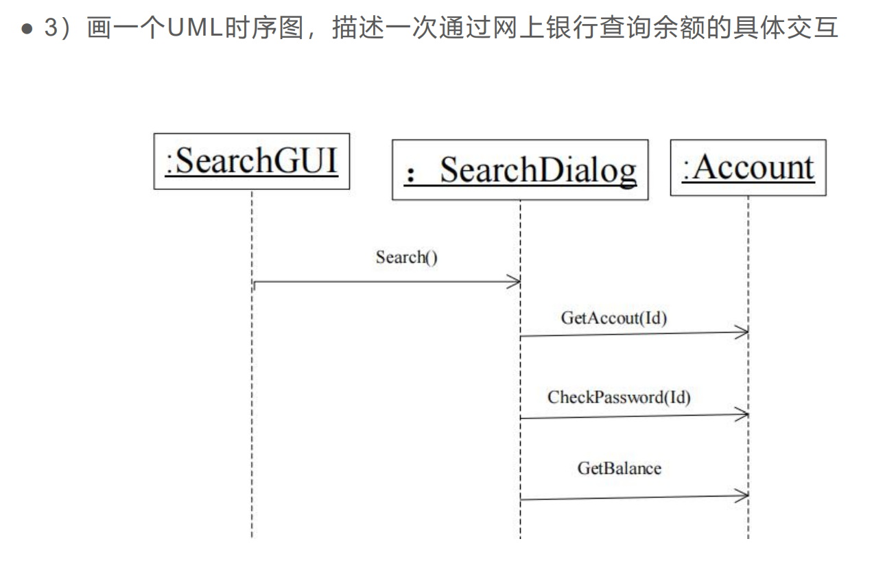

> 参考https://juejin.cn/post/6945499040675004453

