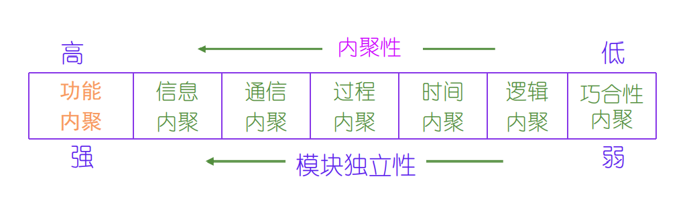
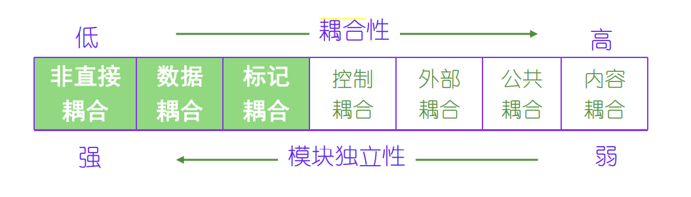
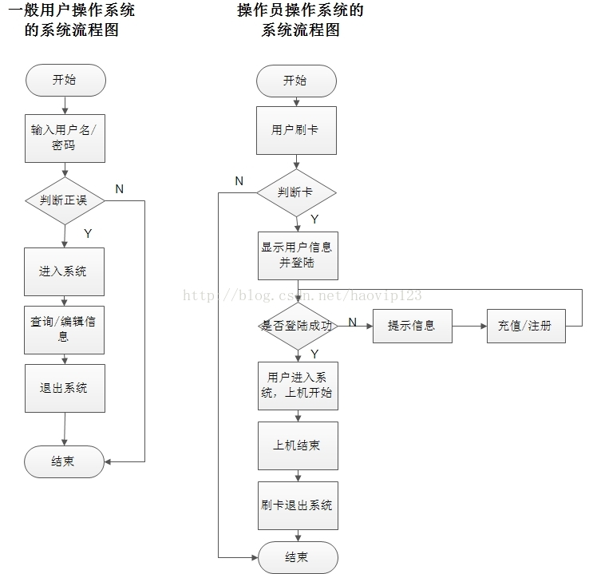
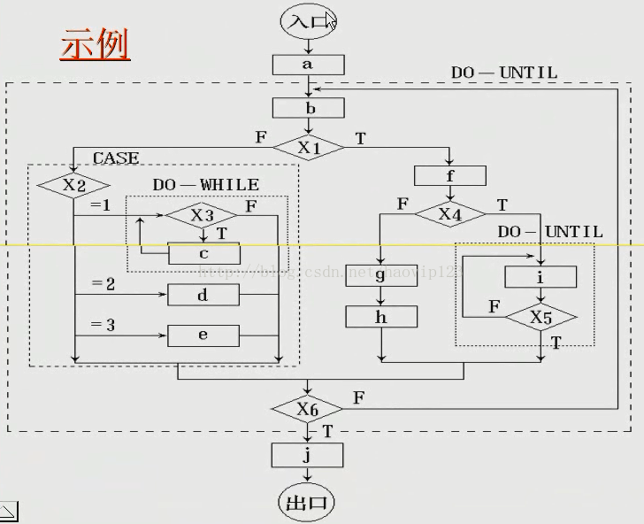
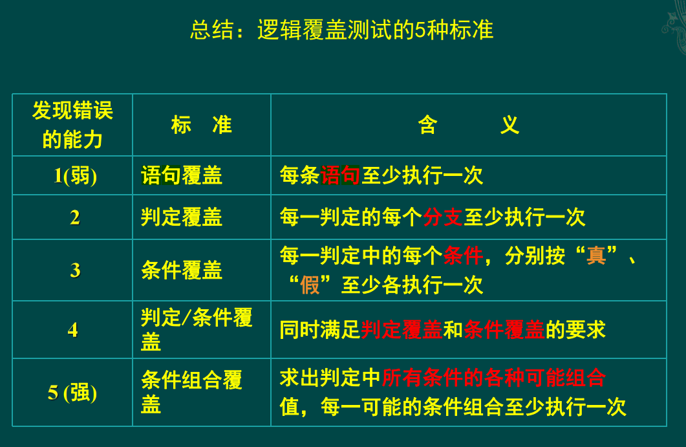
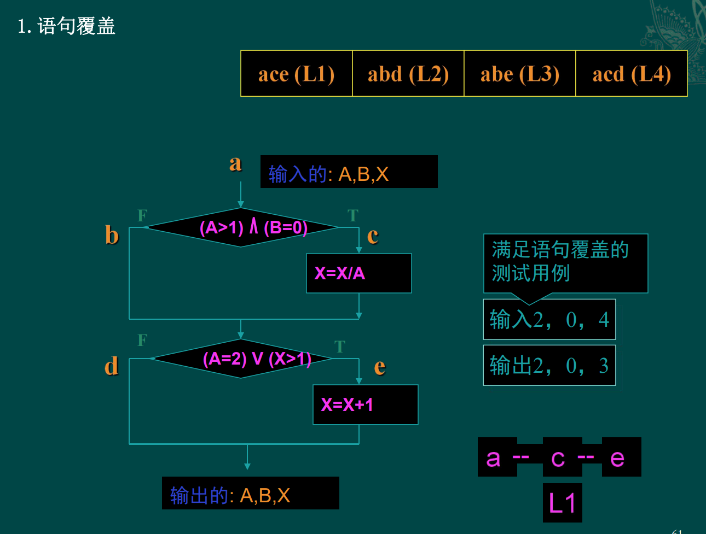
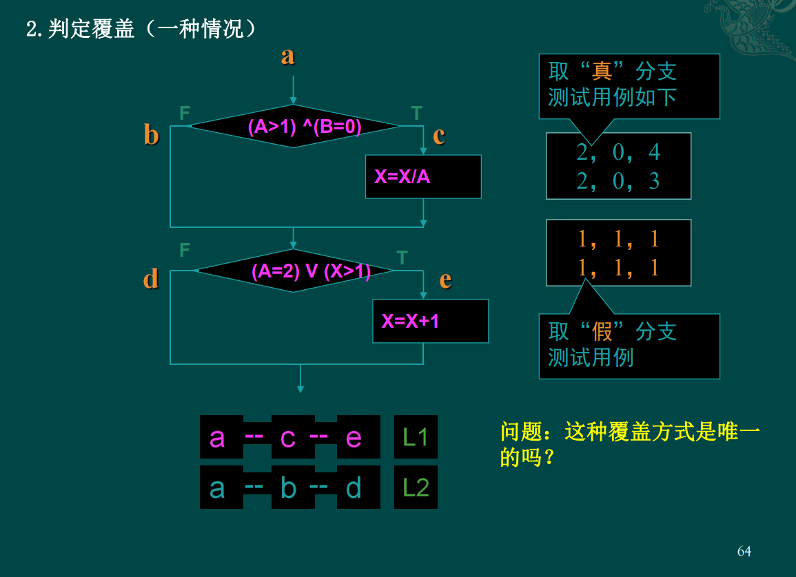
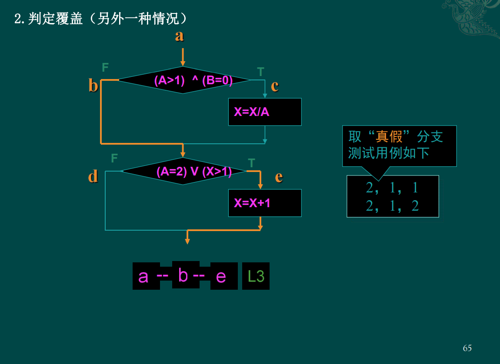
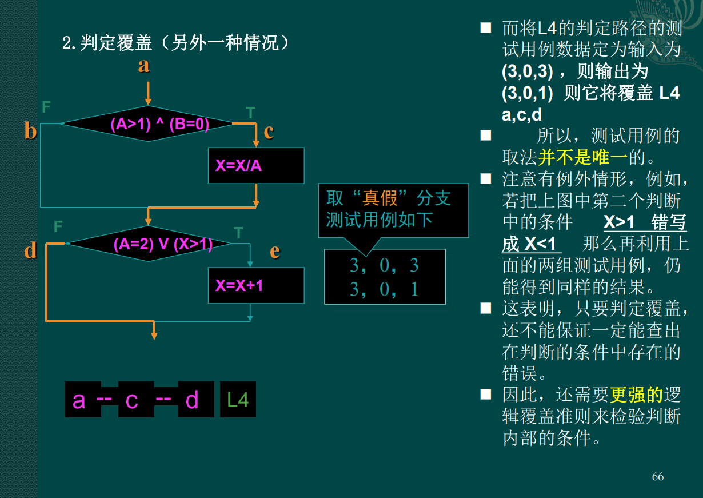

# Software Engineering

***
复习范围：软件危机、软件工程的概念，软件生命周期，可行性研究，需求分析、设计，模块独立性的相关概念，面向对象模型的概念，面向对象的分析和设计，测试用例相关概念等
数据流图，状态图，流程图，盒图，判定表判定树，测试，用例图，事件跟踪图，软件项目管理

补充：er图，PDL，以上这些范围每年都会考，都是活题，不用整本书死记硬背
## 概念啊嗯

### 软件工程

#### 是什么?
根据1993年IEEE的定义：

1. 把系统的、规范的、可度量的途径应用于软件开发、运行和维护过程，也就是把工程应用于软件；
2. 研究1中提到的途径。  

#### 本质特征
软件工程的本质特征：  
1. 软件工程关注于大型程序(软件系统)的构造  		
2. 软件工程的中心课题是分解问题，控制复杂性  		
3. 软件是经常变化的，开发过程中必须考虑软件将来可能的变化  
4. 开发软件的效率非常重要，因此，软件工程的一个重要课题就是，寻求开发与维护软件的更好更有效的方法和工具  
5. 和谐地合作是开发软件的关键  	
6. 软件必须有效地支持它的用户  
7. 在软件工程领域中是由具有一种文化背景的人替具有另一种文化背景的人(完成一些工作)  

#### 消除软件危机的途径
1. 对计算机软件有一个正确的认识(软件≠程序）
2.  必须充分认识到软件开发不是某种个体劳动的神秘技巧，而应该是一种组织良好、管理严密、各类人员协同配合、共同完成的工程项目
3.  推广使用在实践中总结出来的开发软件的成功技术和方法
4.  开发和使用更好的软件工具

### 软件危机
#### 软件危机定义
在计算机软件的开发和维护过程中所遇到的一系列严重问题，它包括两方面：
1. 如何开发软件，已满足对软件日益增长的需求；  
2. 如何维护数量不断增长的已有软件。

#### 软件危机的典型表现 
1. 对软件开发成本和进度的估计常常很不准确。常常出现实际成本比估算成本高出一个数量级、实际进度比计划进度拖延几个月甚至几年的现象。而为了赶进度和节约成本所采取的一些权宜之计又往往损害了软件产品的质量。这些都降低了开发商的信誉，引起用户不满。
2. 用户对已完成的软件不满意的现象时有发生。
3. 软件产品的质量往往是靠不住的。 
4. 软件常常是不可维护的。
5. 软件通常没有适当的文档资料。文档资料不全或不合格，必将给软件开发和维护工作带来许多难以想象的困难和难以解决的问题。
6. 软件成本、软件维护费在计算机系统总成本中所占比例逐年上升。
7. 开发生产率提高的速度远跟不上计算机应用普及的需求。

#### 软件危机出现的原因
1. 来自软件自身的特点：是逻辑部件，缺乏可见性；规模庞大、复杂，修改、维护困难。
2. 软件开发与维护的方法不当：忽视需求分析；认为软件开发等于程序编写；轻视软件维护。
3. 供求矛盾将是一个永恒的主题：面对日益增长的软件需求，人们显得力不从心。

### 软件生存周期
> 软件生存周期定义：一个软件从定义到开发、使用和维护，直到最终被弃用，要经历一个漫长的时期，通常把软件经历的这个漫长的时期称为生存周期。

### 软件危机

### 软件项目管理
> 还没看就是了

### 结构化的程序？
#### 原则
> 结构化程序设计采用自顶向下、逐步求精的设计方法，各个模块通过“顺序、选择、循环”的控制结构进行连接，并且只有**一个入口、一个出口**。
#### 内聚

> 是模块功能强度（即一个模块内部各个元素彼此结合的紧密程度）的度量。模块内部各元素之间联系越紧密，内聚性越强。  
> 
#### 耦合

> 是模块之间相对独立性（即互相连接的紧密程度）的度量。模块间连接越紧密，联系越多，耦合性越强。  
> 
#### 扇入

> 调用（或控制）一个给定模块的模块数目。

#### 扇出

> 一个模块直接调用（或控制）的其他模块数目。

***
## 可行性研究

### 系统流程图
> 好像和流程图差不多
> 
> 

### 数据流图

> Complete through iterations.
> 
> 
> 
> 
> 

### 数据字典

> 数据字典是关于数据的信息的集合，也就是对数据流图中包含的所有元素定义的集合。数据字典是结构方法的核心。数据字典有以下几个条目：数据项条目、数据流条目、文件条目和加工条目。
## 需求分析

### E-R图

>   
## 详细设计

### 程序流程图

> 很简单就是了  
> 
> 
> 

### NS图(盒图)

#### 程序方块

> 

#### 分支方块

> 
> 

#### 测试循环方块

> 先测试为while型，后测试为for型
> 

### 判定表
> 
> 

### 判定树
> 
> 

### **环形复杂度?**
1. 流图中的区域数等于环形复杂度。
2. 流图G的环形复杂度V(G)=E-N+2，其中，E是流图中边的条数，N是结点数。
3. 流图G的环形复杂度V(G)=P+1，其中，P是流图中判定结点的数目。

### PDL
> 
> 

## 实现

### 软件测试

#### 白盒测试（结构测试）

##### 总结
> 

##### 语句覆盖

每个可执行语句都走一遍即可，即测试用例要覆盖所有的语句  
> 将所有语句都执行一遍了，但是判定为FALSE的分支没有执行到
> 

##### 判定覆盖
针对判断语句，在设定案例的时候，要设定True和False的两种案例；与语句覆盖不同的是增加了False的情况
> 
> 显然是不唯一的
> 
> 

##### 条件覆盖
不仅每个语句至少执行一次，而且使判定表达式中的每个条件都取到各种可能的结果。
> 
> 针对判断语句里面案例的取值都要取一次，不考虑条件的取值(条件覆盖保证判断中的**每个条件都被覆盖**)  

满足条件覆盖是否一定满足判定覆盖?
> 条件覆盖通常比判定覆盖强，但满足条件覆盖的测试数据不一定满足判定覆盖。

##### 判定/条件覆盖
> 

##### 条件组合覆盖

> 判定覆盖各条件覆盖交叉，针对于判定中的条件取值
> 

#### 黑盒测试（功能测试）

##### 等价分类法

> 把被测程序的输入域划分为若干各等价类，每个测试用例都代表一类与它等价的其他例子。

##### 边界值分析

> 在等价分类法中，将代表一个类的测试数据选在等价类的边界上。（如：X<=400）。

##  面向对象    

### 用例图

> 小人是Actor，圆圈是事件，方框是系统，左边的箭头是指向被继承者
> 

### 类图

> 

### 状态图

> 好比有限状态机一般
> 箭头上的是事件，方块内的是状态
> 

### 顺序图(事件跟踪图)

> 是的就是这样
> 

