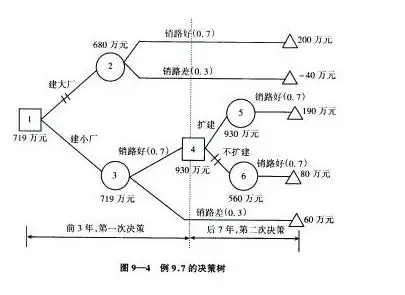
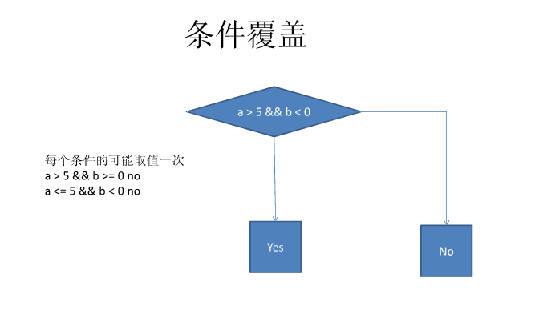

# Software Engineering

***

## 流程图

> 很简单就是了
> 

## NS图(盒图)

### 程序方块

> 

### 分支方块

> 
> 

### 测试循环方块

> 先测试为while型，后测试为for型
> 

## 结构化的程序？

- 原则

> 结构化程序设计采用自顶向下、逐步求精的设计方法，各个模块通过“顺序、选择、循环”的控制结构进行连接，并且只有**一个入口、一个出口**。

## 结构化分析方法？

### Data Flow Diagram

> Complete through iterations.
> 
> 
> 
> 
> 

#### 数据字典

> 数据字典是关于数据的信息的集合，也就是对数据流图中包含的所有元素定义的集合。数据字典是结构方法的核心。数据字典有以下几个条目：数据项条目、数据流条目、文件条目和加工条目。

#### 判定表
> 
> 

#### 判定树
> 
> 

#### E-R图

> 

## 软件测试

### 白盒测试（结构测试）

#### 语句覆盖

> 每个可执行语句都走一遍即可，即测试用例要覆盖所有的语句

#### 判定覆盖

> 针对判断语句，在设定案例的时候，要设定True和False的两种案例；与语句覆盖不同的是增加了False的情况
> 

#### 条件覆盖

> 针对判断语句里面案例的取值都要去一次，不考虑条件的取值(条件覆盖保证判断中的**每个条件都被覆盖**)
> 

#### 判定/条件覆盖

> 

#### 条件组合覆盖

> 判定覆盖各条件覆盖交叉，针对于判定中的条件取值
> 

#### **环形复杂度?**
1. 流图中的区域数等于环形复杂度。
2. 流图G的环形复杂度V(G)=E-N+2，其中，E是流图中边的条数，N是结点数。
3. 流图G的环形复杂度V(G)=P+1，其中，P是流图中判定结点的数目。

### 黑盒测试（功能测试）

#### 等价分类法

> 把被测程序的输入域划分为若干各等价类，每个测试用例都代表一类与它等价的其他例子。

#### 边界值分析

> 在等价分类法中，将代表一个类的测试数据选在等价类的边界上。（如：X<=400）。

## UML

### 用例图

> 小人是Actor，圆圈是事件，方框是系统，左边的箭头是指向被继承者
> 

### 类图

> 

### 状态图

> 好比有限状态机一般
> 箭头上的是事件，方块内的是状态
> 

### 顺序图(事件跟踪图)

> 是的就是这样
> 

## 一些概念

### 内聚

> 是模块功能强度（即一个模块内部各个元素彼此结合的紧密程度）的度量。模块内部各元素之间联系越紧密，内聚性越强。

### 耦合

> 是模块之间相对独立性（即互相连接的紧密程度）的度量。模块间连接越紧密，联系越多，耦合性越强。

### 扇入

> 调用（或控制）一个给定模块的模块数目。

### 扇出

> 一个模块直接调用（或控制）的其他模块数目。

## 软件项目管理

## PDL
> 
> 

