#Software Engineering
***
##Flow chart
> 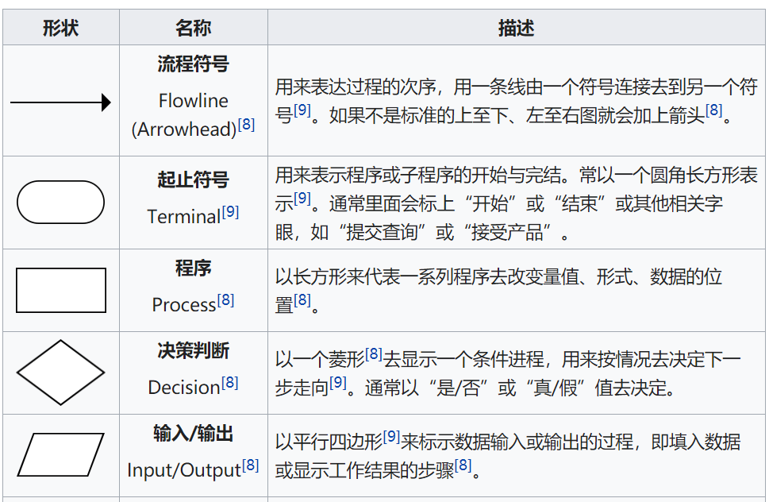
很简单就是了
##NS图(盒图)
- 程序方块
>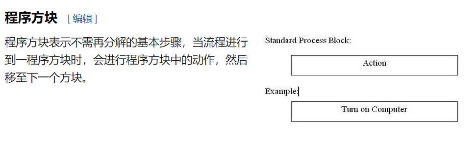
- 分支方块 
> 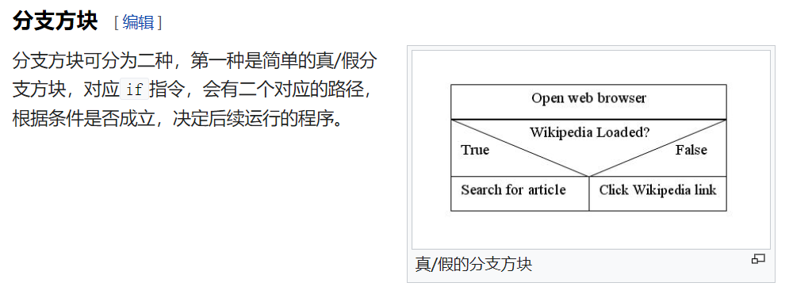
> 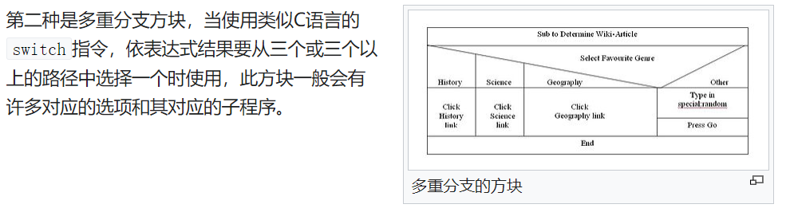
- 测试循环方块
> 先测试为while型，后测试为for型
> 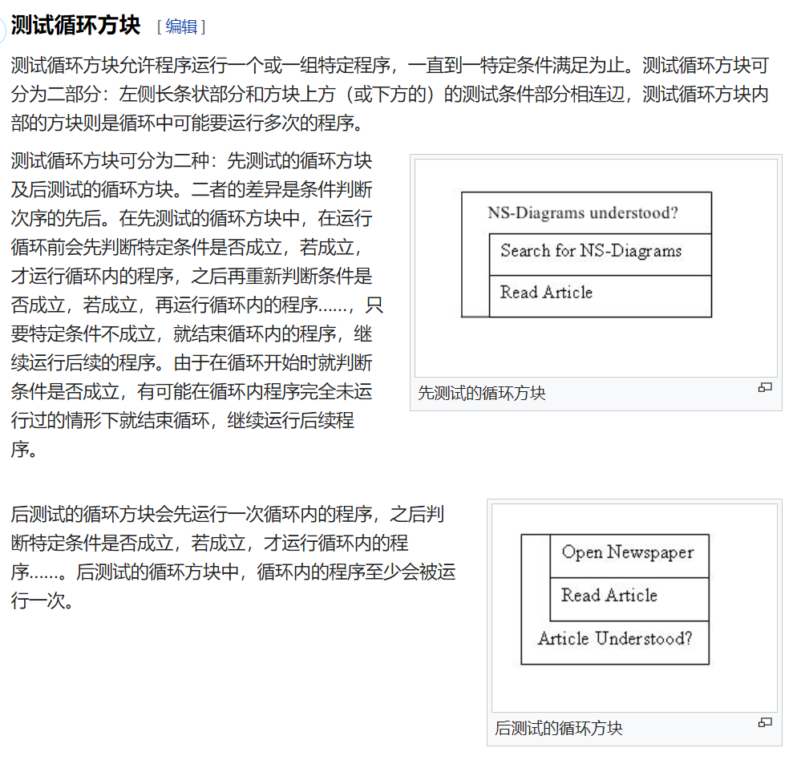

##E-R图
> 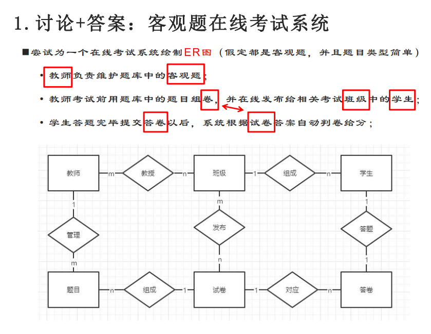

##状态图
> 好比有限状态机一般  
> 箭头上的是事件，方块内的是状态
> 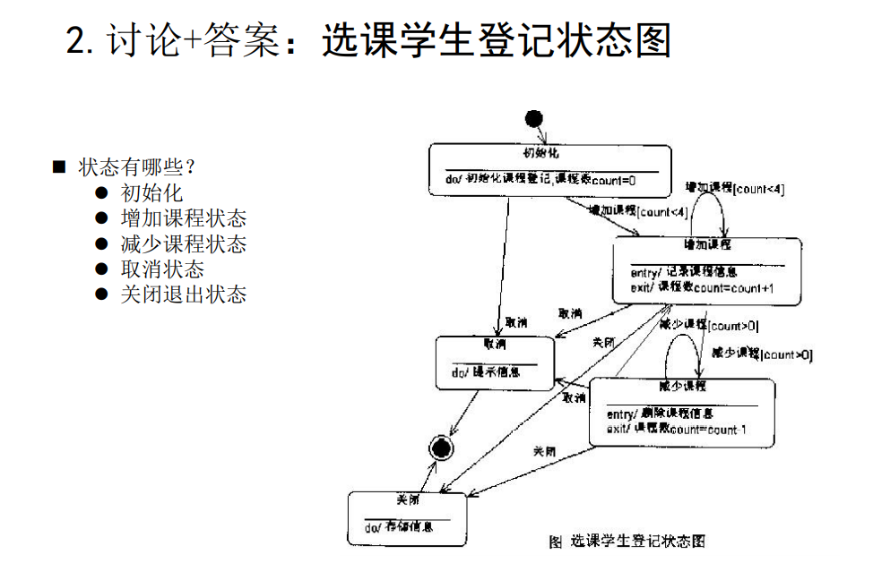

##Data Flow Diagram
> Complete through iterations.
> 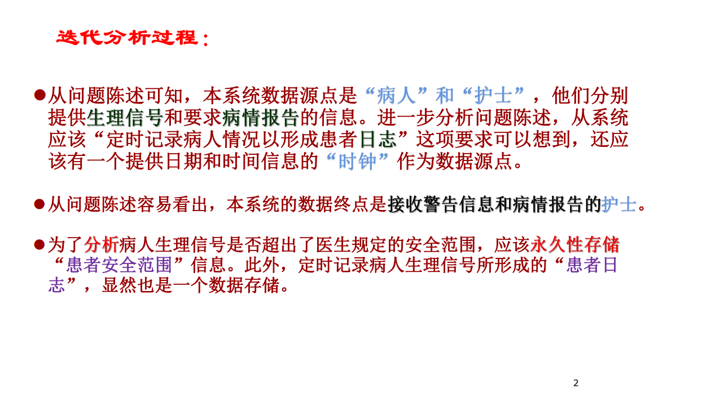
> 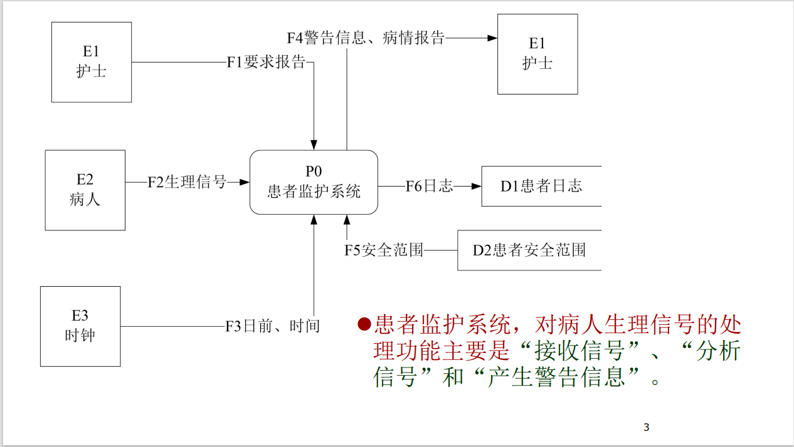
> 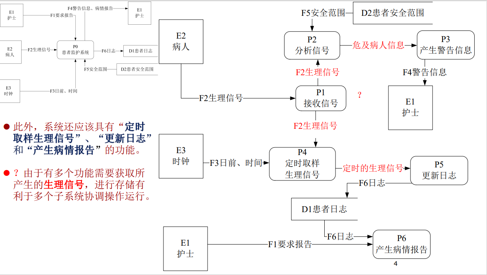
> 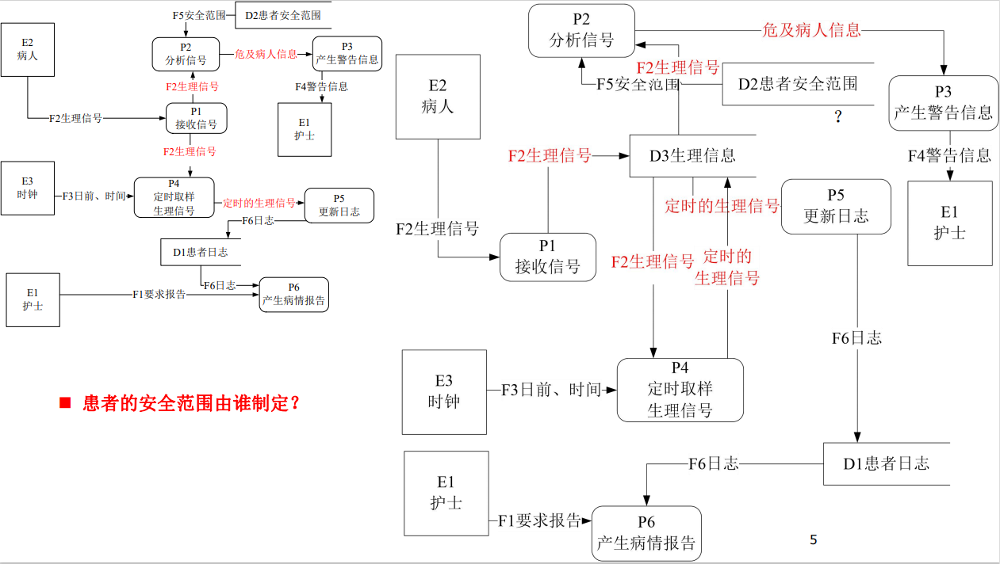
> 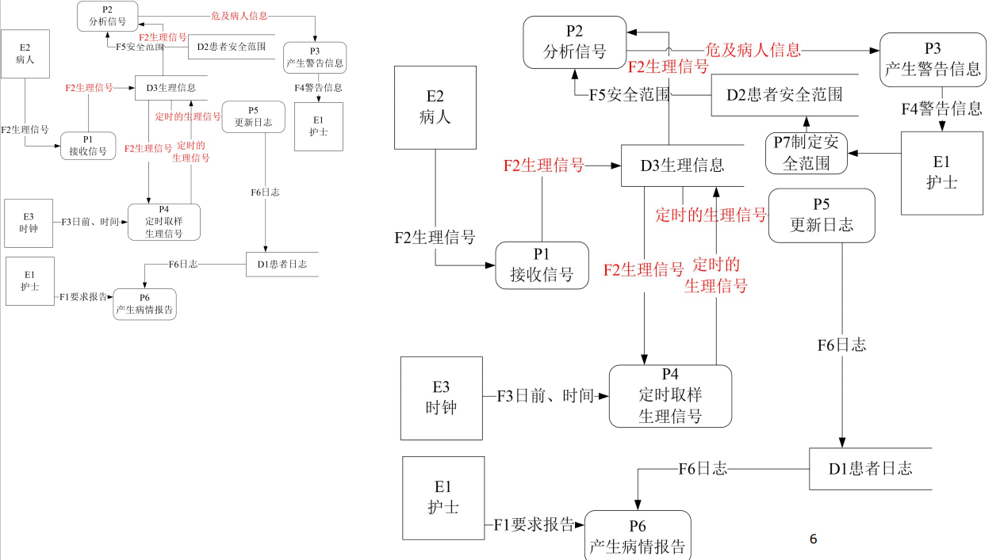

##结构化的程序？
- 原则
> 结构化程序设计采用自顶向下、逐步求精的设计方法，各个模块通过“顺序、选择、循环”的控制结构进行连接，并且只有**一个入口、一个出口**。

##软件测试
- 语句覆盖
> 每个可执行语句都走一遍即可，即测试用例要覆盖所有的语句
- 判定覆盖
> 针对判断语句，在设定案例的时候，要设定True和False的两种案例；与语句覆盖不同的是增加了False的情况
> 
- 条件覆盖
> 针对判断语句里面案例的取值都要去一次，不考虑条件的取值(条件覆盖保证判断中的**每个条件都被覆盖**)
> 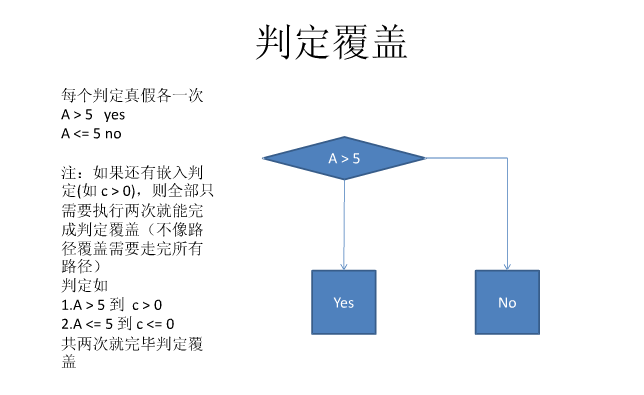
- 判定/条件覆盖
> 
- 条件组合覆盖
> 判定覆盖各条件覆盖交叉，针对于判定中的条件取值
> 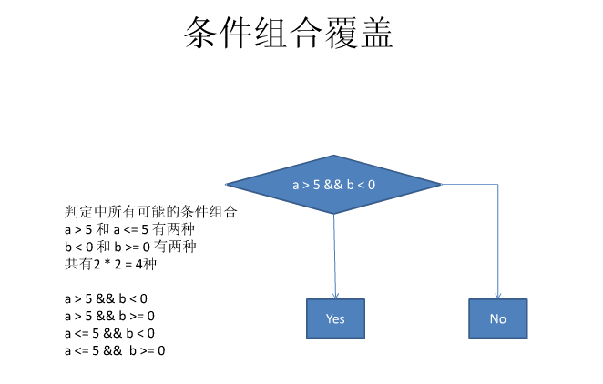

##用例图
> 小人是Actor，圆圈是事件，方框是系统，左边的箭头是指向被继承者
> 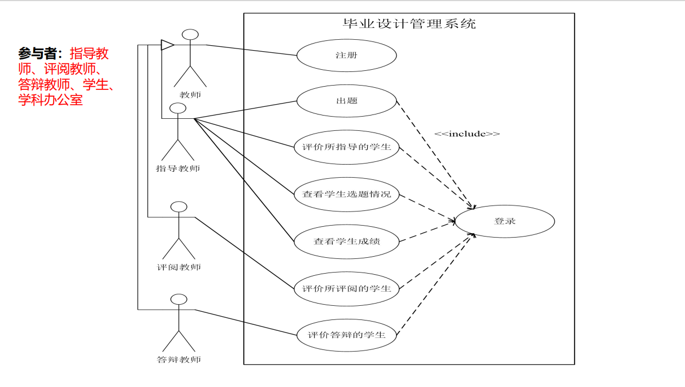

##事件跟踪图 (顺序图)
Hello
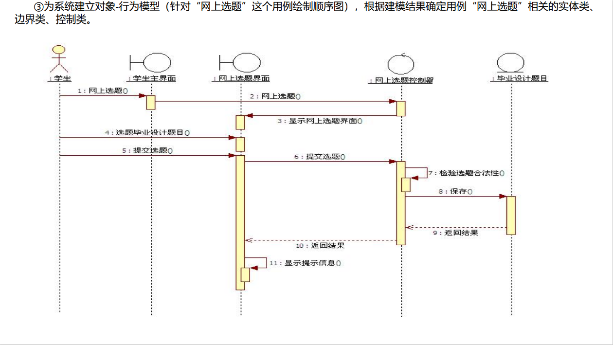

